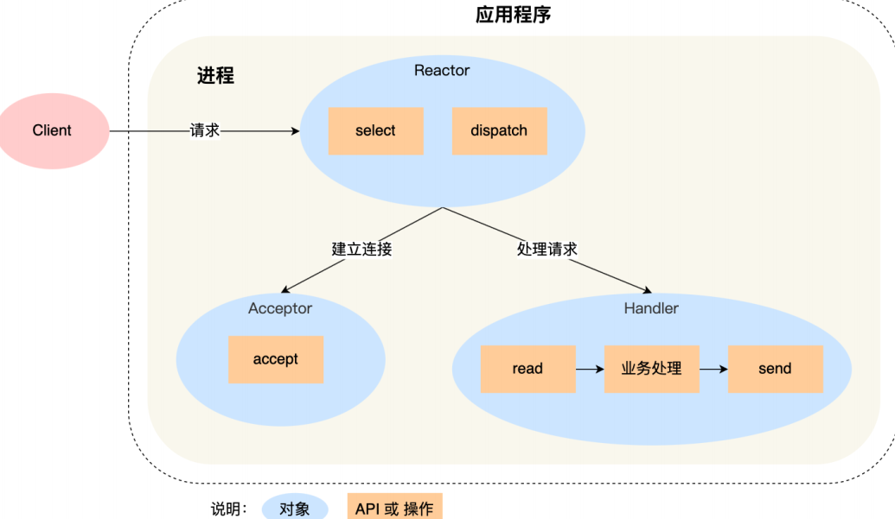

基本是基于 I/O 多路复⽤，⽤过 I/O 多路复⽤接⼝写⽹络程序的同学，肯定知道是⾯向过程的⽅式写代码的，这样的开发的效率不⾼。  

基于⾯向对象的思想，对 I/O 多路复⽤作了⼀层封装，让使⽤者不⽤考虑底层⽹络 API 的细节，只需要关注应⽤代码的编写  ，这种模式就是叫做reactor模式。

## 单 Reactor 单进程  ：

第⼀个缺点，因为只有⼀个进程， ⽆法充分利⽤ **多核 CPU** 的性能；
第⼆个缺点， Handler 对象在业务处理时，整**个进程是⽆法处理其他连接的事件的**， 如果业务处理耗时⽐较⻓，那么就造成响应的延迟；  

所以，单 Reactor 单进程的⽅案不适⽤计算机密集型的场景，只适⽤于业务处理⾮常快速的场景。

Redis 是由 C 语⾔实现的，它采⽤的正是「单 Reactor 单进程」的⽅案，因为 Redis 业务处理主要是在内存中完成，操作的速度是很快的，性能瓶颈不在 CPU 上，所以 Redis 对于命令的处理是单进程的⽅案。  

## 单 Reactor 多线程 / 多进程

如果要克服「单 Reactor 单线程 / 进程」⽅案的缺点，那么就需要引⼊多线程 / 多进程，这样就产⽣了单 Reactor 多线程 / 多进程的⽅案。  

Reactor 对象通过 select （IO 多路复⽤接⼝） 监听事件，收到事件后通过 dispatch 进⾏分发，具体分发给 Acceptor 对象还是 Handler 对象，还要看收到的事件类型；
如果是连接建⽴的事件，则交由 Acceptor 对象进⾏处理， Acceptor 对象会通过 accept⽅法 获取连接，并创建⼀个 Handler 对象来处理后续的响应事件；
如果不是连接建⽴事件， 则交由当前连接对应的 Handler 对象来进⾏响应；  

上⾯的三个步骤和单 Reactor 单线程⽅案是⼀样的，接下来的步骤就开始不⼀样了：  

**Handler 对象不再负责业务处理，只负责数据的接收和发送**， Handler 对象通过 read 读取到数据后，会将数据发给⼦线程⾥的 Processor 对象进⾏业务处理；
⼦线程⾥的 Processor 对象就进⾏业务处理，处理完后，将结果发给主线程中的 Handler对象，接着由 Handler 通过 send ⽅法将响应结果发送给 client；  

单 Reator 多线程的⽅案优势在于能够充分利⽤多核 CPU 的能，那既然引⼊多线程，那么⾃然就带来了多线程竞争资源的问题。  

**另外，「单 Reactor」的模式还有个问题， 因为⼀个 Reactor 对象承担所有事件的监听和响应，⽽且只在主线程中运⾏，在⾯对瞬间⾼并发的场景时，容易成为性能的瓶颈的地⽅**  

## 多 Reactor 多进程 / 线程  

要解决「单 Reactor」的问题，就是将「单 Reactor」实现成「多 Reactor」，这样就产⽣了多 Reactor 多进程 / 线程的⽅案。  

Proactor 正是采⽤了异步 I/O 技术，所以被称为异步⽹络模型。
现在我们再来理解 Reactor 和 Proactor 的区别，就⽐较清晰了。
Reactor 是⾮阻塞同步⽹络模式，感知**的是就绪可读写事件**。在每次感知到有事件发⽣（⽐如可读就绪事件）后，就需要应⽤进程主动调⽤ read ⽅法来完成数据的读取，也就是要应⽤进程主动将 socket 接收缓存中的数据读到应⽤进程内存中，这个过程是同步的，读取完数据后应⽤进程才能处理数据。

Proactor 是异步⽹络模式， 感**知的是已完成的读写事件**。在发起异步读写请求时，需要传⼊数据缓冲区的地址（⽤来存放结果数据）等信息，这样系统内核才可以⾃动帮我们把数据的读写⼯作完成，这⾥的读写⼯作全程由操作系统来做，并不需要像 Reactor 那样还需要应⽤进程主动发起 read/write 来读写数据，操作系统完成读写⼯作后，就会通知应⽤进程直接处理数据。  

⽆论是 Reactor，还是 Proactor，都是⼀种基于「事件分发」的⽹络编程模式，区别在于
Reactor 模式是基于「待完成」的 I/O 事件，⽽ Proactor 模式则是基于「已完成」的 I/O 事件。  
