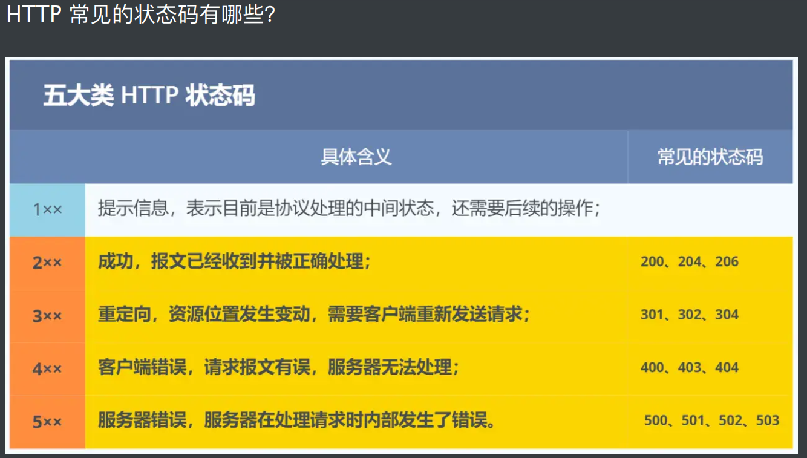

# 简介

HTTP 是**超文本传输协议**，也就是**H**yperText **T**ransfer **P**rotocol。

HTTP 协议是⼀个**双向**协议。
我们在上⽹冲浪时，浏览器是请求⽅ A，百度⽹站就是应答⽅ B。双⽅约定⽤ HTTP 协议来通信，于是浏览器把请求数据发送给⽹站，⽹站再把⼀些数据返回给浏览器，最后由浏览器渲染在屏幕，就可以看到图⽚、视频了。  

HTTP 传输的内容是「**超⽂本**」。
我们先来理解「⽂本」，在互联⽹早期的时候只是简单的字符⽂字，但现在「⽂本」的涵义已经可以扩展为图⽚、视频、压缩包等，在 HTTP 眼⾥这些都算作「⽂本」。  

HTML 就是最常⻅的**超⽂本**了，它本身**只是纯⽂字⽂件**，但**内部⽤很多标签定义了图⽚、视频等的链接**，再经过浏览器的解释，呈现给我们的就是⼀个⽂字、有画⾯的⽹⻚了。  

HTTP 是一个在计算机世界里专门**在「两点」之间「传输」文字、图片、音频、视频等「超文本」数据的 [约定和规范」。**

**1xx** 类状态码属于提示信息，是协议处理中的⼀种**中间状态**，实际⽤到的⽐较少。  

**200 OK」是最常⻅的成功状态码**，表示⼀切正常。如果是⾮ HEAD 请求，服务器返回的响应头都会有 body 数据。
「204 No Content」也是常⻅的成功状态码，与 200 OK 基本相同，但响应头没有 body数据。
「206 Partial Content」是应⽤于 HTTP 分块下载或断点续传，表示响应返回的 body数据并不是资源的全部，⽽是其中的⼀部分，也是服务器处理成功的状态。  

3xx 类状态码表示**客户端请求的资源发⽣了变动**，需要客户端**⽤新的 URL 重新发送请求获取资源，也就是重定向**。
**「301 Moved Permanently」表示永久重定向，说明请求的资源已经不存在了，需改⽤新的 URL 再次访问。**
**「302 Found」表示临时重定向，说明请求的资源还在，但暂时需要⽤另⼀个 URL 来访问。**  

301 和 302 都会在**响应头⾥使⽤字段 Location** ，指明**后续要跳转的 URL**，浏览器会⾃动重定向新的 URL。  

304 Not Modified」不具有跳转的含义，表示资源未修改，重定向已存在的缓冲⽂件，也称缓存重定向，也就是告诉客户端可以继续使⽤缓存资源，⽤于缓存控制。  

==**4xx 类状态码表示客户端发送的报⽂有误**==，服务器⽆法处理，也就是错误码的含义。
「**400** Bad Request」表示**客户端请求的报⽂有错误**，但只是个笼统的错误。
「**403** Forbidden」表示**服务器禁⽌访问资源**，并不是客户端的请求出错。
「**404** Not Found」表示**请求的资源在服务器上不存在或未找到**，所以⽆法提供给客户端。

==**5xx 类状态码表示客户端请求报⽂正确**==，但是服务器处理时内部发⽣了错误，属于服务器端的错误码。
「500 Internal Server Error」与 400 类型，是个笼统通⽤的错误码，服务器发⽣了什么错误，我们并不知道。
**「501 Not Implemented」表示客户端请求的功能还不⽀持，类似“即将开业，敬请期待”的意思。**
**「502 Bad Gateway」通常是服务器作为⽹关或代理时返回的错误码，表示服务器⾃身⼯作正常，访问后端服务器发⽣了错误。**
**「503 Service Unavailable」表示服务器当前很忙，暂时⽆法响应客户端，类似“⽹络服务正忙，请稍后重试”的意思。**  

# HTTP常见字段

==**Host 字段**==：客户端发送请求时，==⽤来指定服务器的域名==。  

有了 Host 字段，就可以将请求发往「同⼀台」服务器上的不同⽹站。  

==**Content-Length 字段**== ：服务器在返回数据时，会有 Content-Length 字段，表明==本次回应的数据⻓度==。  

⼤家应该都知道 HTTP 是基于 TCP 传输协议进⾏通信的，⽽使⽤了 TCP 传输协议，就会存在⼀个“**粘包**”的问题， ==**HTTP 协议通过设置回⻋符、换⾏符作为 HTTP header 的边界**==，通过**Content-Length 字段作为 HTTP body 的边界，这两个⽅式都是为了解决“粘包”的问题**。  

**Connection 字段**  ：Connection 字段最常⽤于客户端要求服务器使⽤**「HTTP ⻓连接」**机制，以便其他请求复⽤。  

**HTTP/1.1 版本的默认连接都是⻓连接**，但为了兼容⽼版本的 HTTP，需要**指定 Connection⾸部字段的值为 Keep-Alive** 。  

开启了 HTTP Keep-Alive 机制后， 连接就不会中断，⽽是保持连接。当客户端发送另⼀个请求时，它会使⽤同⼀个连接，⼀直持续到客户端或服务器端提出断开连接。  

**HTTP的Keep-Alive 机制是应用层(用户态)实现的，称为HTTP长连接机制**

**TCP的keepalive是由TCP层(内核态)实现的，称为TCP保活机制，可以理解为心跳包，来试探对方是否正常响应。**

**Content-Type 字段**  ：Content-Type 字段⽤于服务器回应时，告诉客户端，**本次数据是什么格式。**  

**Content-Encoding 字段**  ：Content-Encoding 字段说明数据的压缩⽅法。表示服务器返回的数据使⽤了什么压缩格式  

# GET 和 POST 有什么区别？  

根据 **RFC** 规范， ==**GET 的语义是从服务器获取指定的资源**==，这个资源可以是静态的⽂本、⻚⾯、图⽚视频等。 **GET 请求的参数位置⼀般是写在 URL 中**， **URL 规定只能⽀持 ASCII，所以GET 请求的参数只允许 ASCII 字符** ，⽽且**浏览器**会对 URL 的**⻓度有限制**（HTTP协议本身对URL⻓度并没有做任何规定）。  

根据 **RFC** 规范， ==**POST 的语义是根据（报⽂body）对指定的资源做出处理**==，具体的处理⽅式视资源类型⽽不同。 **POST 请求携带数据的位置⼀般是写在报⽂ body 中**， body 中的数据可以是任意格式的数据，只要客户端与服务端协商好即可，⽽且浏览器不会对 body ⼤⼩做限制。  

## GET 和 POST ⽅法都是安全和幂等的吗？  

先说明下安全和幂等的概念：
在 HTTP 协议⾥，**所谓的「安全」是指请求⽅法不会「破坏」服务器上的资源。**
所谓的「**幂等**」，**意思是多次执⾏相同的操作，结果都是「相同」的。**  

如果==**从 RFC 规范定义**==的语义来看：
**GET ⽅法就是安全且幂等的**，因为它是「只读」操作，⽆论操作多少次，服务器上的数据都是安全的，且每次的结果都是相同的。所以， 可以对 GET 请求的数据做缓存，这个缓存可以做到浏览器本身上（彻底避免浏览器发请求），也可以做到代理上（如nginx），⽽且在浏览器中 GET 请求可以保存为书签。

POST 因为是「新增或提交数据」的操作，会修改服务器上的资源，所以是不安全的，且多次提交数据就会创建多个资源，所以不是幂等的。所以， 浏览器⼀般不会缓存 POST请求，也不能把 POST 请求保存为书签。  

==但是实际过程中，开发者不⼀定会按照 RFC 规范定义的语义来实现 GET 和 POST ⽅法==。⽐如：
可以⽤ GET ⽅法实现新增或删除数据的请求，这样实现的 GET ⽅法⾃然就不是安全和幂等。
可以⽤ POST ⽅法实现查询数据的请求，这样实现的 POST ⽅法⾃然就是安全和幂等。曾经有个笑话，有⼈写了个博客，删除博客⽤的是 GET 请求，他觉得没⼈访问就连鉴权都没做。然后 Google 服务器爬⾍爬了⼀遍，他所有博⽂就没了。。。  

要避免传输过程中数据被窃取，就要使⽤ HTTPS 协议，这样所有 HTTP 的数据都会被加密传输。  

### GET 请求可以带 body 吗？ 

**RFC 规范并没有规定 GET 请求不能带 body 的。理论上，任何请求都可以带 body 的。只是因为 RFC 规范定义的 GET 请求是获取资源，所以根据这个语义不需要⽤到 body。另外， URL 中的查询参数也不是 GET 所独有的， POST 请求的 URL 中也可以有参数的。**  

# HTTP缓存技术

对于⼀些具有重复性的 HTTP 请求，⽐如每次请求得到的数据都⼀样的，我们可以把这对「请求-响应」的数据都缓存在本地，那么下次就直接读取本地的数据，不必在通过⽹络获取服务器的响应了，这样的话 HTTP/1.1 的性能肯定⾁眼可⻅的提升。  

所以，避免发送 HTTP 请求的⽅法就是通过缓存技术， HTTP 设计者早在之前就考虑到了这点，因此 HTTP 协议的头部有不少是针对缓存的字段。
HTTP 缓存有两种实现⽅式，分别是**强制缓存和协商缓存。**  

## 强缓存

==**强缓存**==指的是**只要浏览器判断缓存没有过期，则直接使⽤浏览器的本地缓存，决定==是否使⽤缓存的主动性在于浏览器这边==。**  

强缓存是利⽤下⾯这两个 HTTP 响应头部（Response Header）字段实现的，它们都⽤来表示资源在客户端缓存的有效期：

==Cache-Control== ， 是⼀个**相对时间**；
==Expires==，是⼀个**绝对时间**；**如果 HTTP 响应头部同时有 Cache-Control 和 Expires 字段的话， Cache-Control 的优先级⾼于 Expires 。**  

Cache-control 选项更多⼀些，设置更加精细，所以建议使⽤ Cache-Control 来实现强缓存。
具体的实现流程如下：

**当浏览器第⼀次请求访问服务器资源时，服务器会在返回这个资源的同时，在 Response头部加上 Cache-Control， Cache-Control 中设置了过期时间⼤⼩；**

浏览器再次请求访问服务器中的该资源时，会先**通过请求资源的时间与 Cache-Control中设置的过期时间⼤⼩**，来计算出该资源是否过期，如果没有，则使⽤该缓存，否则重新请求服务器；**服务器再次收到请求后，会再次更新 Response 头部的 Cache-Control。**  

## 协商缓存

当我们在浏览器使⽤开发者⼯具的时候，你可能会看到过某些请求的响应码是 **304** ，这个是**告诉浏览器可以使⽤本地缓存的资源**，**通常这种==通过服务端告知客户端是否可以使⽤缓存==的⽅式被称为==协商缓存==**。  

所以**协商缓存就是与服务端协商之后，通过协商结果来判断是否使⽤本地缓存。**  

第⼀种：==**请求头部中的 If-Modified-Since 字段与响应头部中的 Last-Modified 字段实现**==，这两个字段的意思是：  

响应头部中的 **Last-Modified ：标示这个响应资源的最后修改时间**；
请求头部中的 **If-Modified-Since** ：当资源过期了，发现响应头中具有 Last-Modified声明，则再次发起请求的时候带上 Last-Modified 的时间，服务器收到请求后发现有 If Modified-Since 则**与被请求资源的最后修改时间进⾏对⽐**（Last-Modified），**如果最后修改时间较新（⼤），说明资源⼜被改过，则返回最新资源**， HTTP 200 OK；**如果最后修改时间较旧（⼩），说明资源⽆新修改，响应 HTTP 304 ⾛缓存。**  

第⼆种：==**请求头部中的 If-None-Match 字段与响应头部中的 ETag 字段**==，这两个字段的意思是：
响应头部中 **Etag ：唯⼀标识响应资源；**
请求头部中的 **If-None-Match** ：当**资源过期**时，浏览器发现**响应头⾥有 Etag**，则再次向服务器发起请求时，会将请求头 **If-None-Match 值设置为 Etag** 的值。**服务器收到请求后进⾏⽐对，如果资源没有变化返回 304，如果资源变化了返回 200**  

**第⼀种**实现⽅式是**基于时间实现**的，**第⼆种**实现⽅式是基于⼀个**唯⼀标识**实现的，相对来说**后者可以更加准确地判断⽂件内容是否被修改，避免由于时间篡改导致的不可靠问题。**  

如果在第⼀次请求资源的时候，服务端返回的 HTTP 响应头部同时有 Etag 和 Last-Modified字段，那么客户端再下⼀次请求的时候，**如果带上了 ETag 和 Last-Modified 字段信息给服务端， 这时 Etag 的优先级更⾼**，也就是服务端先会判断 Etag 是否变化了，**如果 Etag 有变化就不⽤在判断 Last-Modified 了，如果 Etag 没有变化，然后再看 Last-Modified。**  

为什么 ETag 的优先级更⾼？ 这是因为 ETag 主要能解决 Last-Modified ⼏个⽐较难以解决的
问题：

1. **在没有修改⽂件内容情况下⽂件的最后修改时间可能也会改变**，这会导致客户端认为这⽂件被改动了，从⽽重新请求；
2. **可能有些⽂件是在秒级以内修改的， If-Modified-Since 能检查到的粒度是秒级的**，使⽤ Etag就能够保证这种需求下客户端在 1 秒内能刷新多次；
3.  有些服务器不能精确获取⽂件的最后修改时间。  

注意， ==协商缓存这两个字段都需要配合强制缓存中 Cache-Control 字段来使⽤，只有在未能命中强制缓存的时候，才能发起带有协商缓存字段的请求==。  

## HTTP/1.1优点

1. 简单  

   HTTP 基本的报⽂格式就是 **header + body** ，头部信息也是 key-value 简单⽂本的形式，易于理解，降低了学习和使⽤的⻔槛。  

2. 灵活和易于扩展
   HTTP 协议⾥的各类请求⽅法、 URI/URL、状态码、头字段等每个组成要求都没有被固定死，都允许开发⼈员⾃定义和扩充。
   同时 HTTP 由于是⼯作在应⽤层（ OSI 第七层），则**它下层可以随意变化**，⽐如：**HTTPS 就是在 HTTP 与 TCP 层之间增加了 SSL/TLS 安全传输层**；
   **HTTP/1.1 和 HTTP/2.0 传输协议使⽤的是 TCP 协议，⽽到了 HTTP/3.0 传输协议改⽤了基于UDP 协议的QUIC**。  
3.  应⽤⼴泛和跨平台
   互联⽹发展⾄今， HTTP 的应⽤范围⾮常的⼴泛，从台式机的浏览器到⼿机上的各种 APP，从看新闻、刷贴吧到购物、理财、吃鸡， HTTP 的应⽤遍地开花，同时**天然具有跨平台的优越性**。  

## 缺点

**HTTP** 协议⾥有优缺点⼀体的双刃剑，分别是==「⽆状态、明⽂传输」==，同时还有⼀⼤缺点「不安全」。  

1. ⽆状态双刃剑
   ⽆状态的好处，因为服务器不会去记忆 HTTP 的状态，所以不需要额外的资源来记录状态信息，这能减轻服务器的负担，能够把更多的 CPU 和内存⽤来对外提供服务。
   **⽆状态的坏处，既然服务器没有记忆能⼒，它在完成有关联性的操作时会⾮常麻烦**。
   例如登录->添加购物⻋->下单->结算->⽀付，这系列操作都要知道⽤户的身份才⾏。但服务器不知道这些请求是有关联的，每次都要问⼀遍身份信息。
   这样每操作⼀次，都要验证信息，这样的购物体验还能愉快吗？别问，问就是酸爽！
   对于⽆状态的问题，解法⽅案有很多种，**其中⽐较简单的⽅式⽤ Cookie 技术。**
   **Cookie 通过在请求和响应报⽂中写⼊ Cookie 信息来控制客户端的状态。** 

   相当于， 在客户端第⼀次请求后，服务器会下发⼀个装有客户信息的「⼩贴纸」，后续客户端请求服务器的时候，带上「⼩贴纸」，服务器就能认得了了，   

2. 明⽂传输双刃剑
   明⽂意味着在传输过程中的信息，是可⽅便阅读的，⽐如 Wireshark 抓包都可以直接⾁眼查看，为我们调试⼯作带了极⼤的便利性。
   但是这正是这样， HTTP 的所有信息都暴露在了光天化⽇下，相当于信息裸奔。在传输的漫⻓的过程中，信息的内容都毫⽆隐私可⾔，很容易就能被窃取，如果⾥⾯有你的账号密码信息，那你号没了。  

3. 不安全
   HTTP ⽐较严重的缺点就是不安全：
   通信使⽤明⽂（不加密），内容可能会被窃听。⽐如， 账号信息容易泄漏，那你号没了。不验证通信⽅的身份，因此有可能遭遇伪装。⽐如， 访问假的淘宝、拼多多，那你钱没了。⽆法证明报⽂的完整性，所以有可能已遭篡改。⽐如， ⽹⻚上植⼊垃圾⼴告，视觉污染，眼没了。  

## HTTP/1.1性能

**早期 HTTP/1.0 性能上的⼀个很⼤的问题，那就是每发起⼀个请求，都要新建⼀次 TCP 连接（三次握⼿），⽽且是串⾏请求，做了⽆谓的 TCP 连接建⽴和断开，增加了通信开销。**为了解决上述 TCP 连接问题， HTTP/1.1 提出了⻓连接的通信⽅式，也叫持久连接。这种⽅式的好处在于减少了 TCP 连接的重复建⽴和断开所造成的额外开销，减轻了服务器端的负载  

管道网络传输：

**HTTP/1.1 采用了长连接的方式**，这使得管道(pipeline)网络传输成为了可能。即可在同一个 TCP 连接里面，客户端可以发起多个请求，只要第一个请求发出去了，不必等其回来，就可以发第二个请求出去，可以减少整体的响应时间。

但是==服务器必须按照接收请求的顺序发送对这些管道化请求的相应==，如果服务端在处理 A 请求时耗时比较长，那么后续的请求的处理都会被阻塞住，这称为==「队头堵塞」==所以，==HTTP/1.1 管道**解决了请求的队头阻塞，但是没有解决响应的队头阻塞**==。

# HTTP/1.1、 HTTP/2、 HTTP/3 演变

## HTTP/1.1 相⽐ HTTP/1.0 提⾼了什么性能？

HTTP/1.1 相⽐ HTTP/1.0 性能上的改进：
	使⽤**⻓连接的⽅式**改善了 HTTP/1.0 短连接造成的性能开销。
	⽀持**管道（pipeline）⽹络传输**，只要第⼀个请求发出去了，不必等其回来，就可以发第⼆个请求出去，可以减少整体的响应时间。  

但 HTTP/1.1 还是有性能瓶颈：
请求 / 响应**头部（Header）未经压缩就发送**，⾸部信息越多延迟越⼤。**只能压缩 Body的部分**；
发送冗⻓的⾸部。每次互相发送相同的⾸部造成的浪费较多；
**服务器是按请求的顺序响应的，如果服务器响应慢**，会招致客户端⼀直请求不到数据，也就是队头阻塞；
没有请求优先级控制；
**请求只能从客户端开始，服务器只能被动响应**  

## HTTP/2 做了什么优化？

HTTP/2 协议是基于 HTTPS 的，所以 HTTP/2 的安全性也是有保障的。  

那 HTTP/2 相⽐ HTTP/1.1 性能上的改进：
**头部压缩**
**⼆进制格式**
**并发传输**
**服务器主动推送资源**  

1. ==**头部压缩**==
   HTTP/2 会压缩头（Header）如果你**同时发出多个请求**，他们的头是⼀样的或是相似的，那么，**协议会帮你消除重复的部分**。
   这就是所谓的 HPACK 算法：在客户端和服务器同时维护⼀张头信息表，所有字段都会存⼊这个表，**⽣成⼀个索引号，以后就不发送同样字段了，只发送索引号，这样就提⾼速度了。**  

2. ⼆进制格式
   HTTP/2 不再像 HTTP/1.1 ⾥的纯⽂本形式的报⽂，⽽是**全⾯采⽤了⼆进制格式，头信息和数据体都是⼆进制**，并且统称为帧（frame）： **头信息帧（Headers Frame）和数据帧（DataFrame） 。**  

3. 并发传输  
   我们都知道 HTTP/1.1 的实现是基于请求-响应模型的。**同⼀个连接中， HTTP 完成⼀个事务（请求与响应），才能处理下⼀个事务，也就是说在发出请求等待响应的过程中，是没办法做其他事情的，如果响应迟迟不来，那么后续的请求是⽆法发送的，也造成了队头阻塞的问题。**
   ⽽ ==**HTTP/2 就很⽜逼了，引出了 Stream 概念，多个 Stream 复⽤在⼀条 TCP 连接。**==

   针对不同的 HTTP 请求⽤独⼀⽆⼆的 Stream ID 来区分，接收端可以通过 Stream ID 有序组装成 HTTP 消息，不同 Stream 的帧是可以乱序发送的，因此可以并发不同的 Stream ，也就是 HTTP/2 可以并⾏交错地发送请求和响应

4. 服务器推送
   HTTP/2 还在⼀定程度上改善了传统的「请求 - 应答」⼯作模式，服务端不再是被动地响应，可以主动向客户端发送消息。
   **客户端和服务器双⽅都可以建⽴ Stream， Stream ID 也是有区别的，客户端建⽴的 Stream必须是奇数号，⽽服务器建⽴的 Stream 必须是偶数号**  

HTTP/2 通过 Stream 的并发能⼒，解决了 HTTP/1 队头阻塞的问题，看似很完美了，**但是HTTP/2 还是存在“队头阻塞”的问题，只不过问题不是在 HTTP 这⼀层⾯，⽽是在 TCP 这⼀层。**  

**HTTP/2 是基于 TCP 协议来传输数据的**， TCP 是字节流协议， TCP 层必须**保证收到的字节数据是完整且连续的**，这样内核才会将缓冲区⾥的数据返回给 HTTP 应⽤，那么当「前 1 个字节数据」没有到达时，后收到的**字节数据只能存放在内核缓冲区**⾥，只有等到这 1 个字节数据到达时， HTTP/2 应⽤层才能从内核中拿到数据，这就是 HTTP/2 队头阻塞问题。  

## HTTP/3 做了哪些优化？  

前⾯我们**知道了 HTTP/1.1 和 HTTP/2 都有队头阻塞**的问题：
HTTP/1.1 中的管道（ pipeline）虽然解决了请求的队头阻塞，但是没有解决响应的队头阻塞，因为服务端需要按顺序响应收到的请求，如果服务端处理某个请求消耗的时间⽐较⻓，那么只能等响应完这个请求后， 才能处理下⼀个请求，这属于 HTTP 层队头阻塞。
HTTP/2 虽然通过多个请求复⽤⼀个 TCP 连接解决了 HTTP 的队头阻塞 ，但是⼀旦发⽣丢包，就会阻塞住所有的 HTTP 请求，这属于 TCP 层队头阻塞。
**HTTP/2 队头阻塞的问题是因为 TCP，所以 HTTP/3 把 HTTP 下层的 TCP 协议改成了UDP！**  

UDP 发送是不管顺序，也不管丢包的，所以不会出现像 HTTP/2 队头阻塞的问题。⼤家都知道 UDP 是不可靠传输的，但基于 UDP 的 QUIC 协议 可以实现类似 TCP 的可靠性传输。  

### QUIC 有以下 3 个特点。

### 1.⽆队头阻塞

QUIC协议也有类似 HTTP/2 Stream 与多路复用的概念，也是可以在同一条连接上并发传输多个 StreamStream 可以认为就是一条 HTTP 请求。
QUIC 有自己的一套机制可以保证传输的可靠性的。**当某个流发生丢包时，只会阻塞这个流，其他流不会受到影响，因此不存在队头阻塞问题。**这与 HTTP/2 不同，HTTP/2 只要某个流中的数据包丢失了，其他流也会因此受影响。
所以，QUIC连接上的多个 Stream 之间并没有依赖，都是独立的，某个流发生丢包了，只会影响该流，其他流不受影响。

### 2.更快的连接建⽴

**对于 HTTP/1 和 HTTP/2 协议**，**TCP 和 TLS 是分层的**，分别属于内核实现的传输层、openssl 库实现的表示层，因此它们难以合并在一起，需要分批次来握手，==先 TCP 握手，再 TLS 握手==。
HTTP/3 在传输数据前虽然需要 QUIC 协议握手，但是这个握手过程只需要1RTT，握手的目的是为确认双方的「连接 ID」，连接迁移就是基于连接 ID 实现的。
但是 HTTP/3 的 QUIC 协议并不是与 TLS 分层，而是==QUIC 内部包含了 TLS==，它在**自己的帧会携带 TLS 里的“记录”**，再加上 QUIC 使用的是 TLS/1.3，因此**仅需1个 RTT 就可以「同时」完成建立连接与密钥协商，如下图:**

### 3.连接迁移

基于 **TCP 传输协议**的 HTTP 协议，由于是通过**四元组(源IP、源端口、目的 IP、目的端口)**确定一条 TCP连接。

那么当**移动设备的网络从 4G 切换到 WIF 时，意味着IP 地址变化了，那么就必须要断开连接，然后重新建立连接**。而建立连接的过程包含 TCP 三次握手和 TLS 四次握手的时延，以及 TCP 慢启动的减速过程给用户的感觉就是网络突然卡顿了一下，因此连接的迁移成本是很高的。

而 **QUIC 协议没有用四元组的方式来“绑定”连接，而是通过连接 ID 来标记通信的两个端点**，客户端和服务器可以各自选择一组 ID 来标记自己，因此即使移动设备的网络变化后，导致IP 地址变化了，只要仍保有上下文信息(比如连接 ID、TLS 密钥等)，就可以“无缝”地复用原连接，消除重连的成本，没有丝毫卡顿感，达到了连接迁移的功能。

QUIC 是⼀个在 **UDP 之上的伪 TCP + TLS + HTTP/2 的多路复⽤的协议。**  